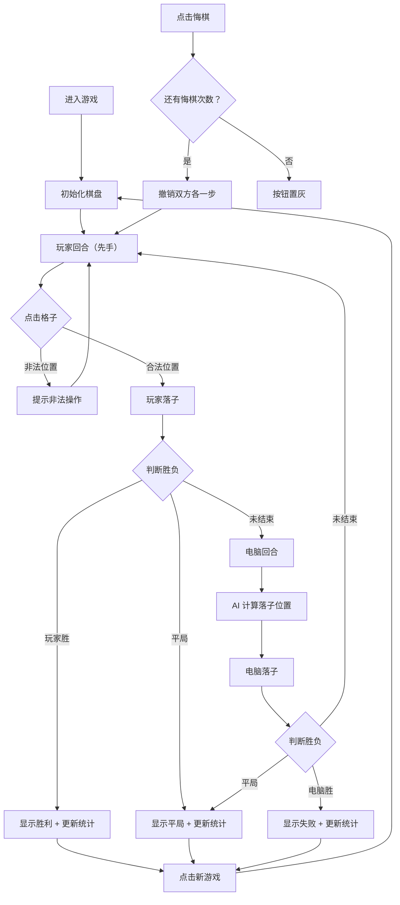

## 1. 产品概述

井字棋人机对战网页游戏，玩家执先手与电脑对战，支持三种难度模式。游戏数据本地持久化，适配桌面端与移动端。

- 核心目标：提供一个趣味性强、体验流畅的井字棋游戏
- 目标用户：休闲游戏玩家，喜欢策略类小游戏的用户
- 产品价值：在经典井字棋基础上增加难度梯度和数据统计，提升游戏可玩性

## 2. 核心功能

### 2.1 功能模块

1. **游戏主界面**：三乘三棋盘、当前回合提示、游戏结果显示
2. **难度选择**：简单、普通、困难三档难度切换
3. **操作控制**：新游戏、悔棋功能
4. **统计侧边栏**：各难度下的总局数、胜局、平局统计
5. **数据持久化**：localStorage 存储统计数据

### 2.2 页面详情

| 页面名称 | 模块名称 | 功能描述 |
|-----------|-------------|---------------------|
| 游戏主页面 | 棋盘区域 | 3x3 格子，点击/触控落子，非法位置提示 |
| 游戏主页面 | 难度选择 | 三档难度切换按钮，新游戏保留当前难度 |
| 游戏主页面 | 操作按钮 | 新游戏按钮、悔棋按钮（每局限一次） |
| 游戏主页面 | 状态提示 | 显示当前回合、游戏结果（胜负平） |
| 游戏主页面 | 统计侧边栏 | 按难度分类显示总局数、胜局、平局数 |

## 3. 核心流程

## 4. 用户界面设计

### 4.1 设计风格

- **主色调**：深蓝色系（#1e3a5f 主背景，#3b82f6 玩家色，#ef4444 电脑色）
- **辅助色**：浅灰（#f1f5f9）、深灰（#334155）
- **按钮风格**：圆角按钮，悬停有阴影效果，点击有缩放反馈
- **字体**：使用现代无衬线字体，标题加粗
- **布局风格**：左侧统计侧边栏 + 中央游戏区，响应式布局移动端侧边栏转为顶部

### 4.2 页面设计概览

| 页面名称 | 模块名称 | UI 元素 |
|-----------|-------------|-------------|
| 游戏主页面 | 棋盘区域 | 3x3 网格，悬停高亮，落子动画，获胜连线高亮 |
| 游戏主页面 | 难度选择 | 三个切换按钮，选中状态高亮 |
| 游戏主页面 | 操作按钮 | 新游戏按钮（主色）、悔棋按钮（次要色） |
| 游戏主页面 | 状态提示 | 大字号文字，颜色区分胜负 |
| 游戏主页面 | 统计侧边栏 | 卡片式布局，数据清晰，按难度分组 |

### 4.3 响应式设计

- 桌面端（> 768px）：左侧固定侧边栏，中央游戏区
- 平板端（768px - 1024px）：侧边栏宽度调整，游戏区居中
- 移动端（< 768px）：侧边栏移至顶部，游戏区全屏宽度
- 触控优化：格子最小 44px 可点击区域，触控反馈

### 4.4 动效与交互

- 落子动画：缩放 + 透明度渐变
- 获胜连线：高亮闪烁效果
- 按钮悬停：阴影加深 + 轻微上浮
- 页面加载：元素淡入效果
- 非法点击：轻微抖动提示
