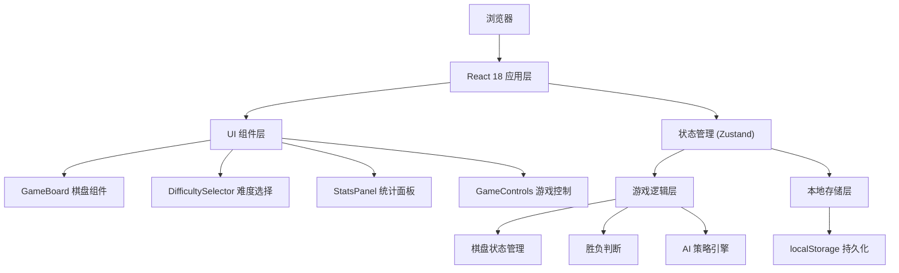

## 1. 架构设计



## 2. 技术栈描述

- **前端框架**：React 18 + TypeScript
- **构建工具**：Vite 5
- **样式方案**：Tailwind CSS 3
- **状态管理**：Zustand
- **图标库**：Lucide React
- **开发服务器端口**：3003

## 3. 目录结构

```
src/
├── components/          # 组件目录
│   ├── GameBoard.tsx       # 棋盘组件
│   ├── Cell.tsx            # 单个格子组件
│   ├── DifficultySelector.tsx  # 难度选择器
│   ├── StatsPanel.tsx     # 统计面板
│   └── GameControls.tsx   # 游戏控制按钮
├── hooks/             # 自定义 hooks
│   └── useGameLogic.ts     # 游戏逻辑 hook
├── utils/             # 工具函数
│   ├── ai.ts              # AI 策略算法
│   └── storage.ts         # 本地存储工具
├── store/             # 状态管理
│   └── gameStore.ts       # 游戏状态 store
├── types/             # 类型定义
│   └── game.ts            # 游戏相关类型
├── App.tsx           # 主应用组件
├── main.tsx          # 入口文件
└── index.css         # 全局样式
```

## 4. 核心类型定义

```typescript
// 玩家类型
type Player = 'X' | 'O';

// 格子状态
type CellValue = Player | null;

// 棋盘状态
type Board = CellValue[][];

// 难度等级
type Difficulty = 'easy' | 'medium' | 'hard';

// 游戏状态
type GameStatus = 'playing' | 'playerWin' | 'computerWin' | 'draw';

// 统计数据
interface Stats {
  total: number;
  wins: number;
  draws: number;
}

// 各难度统计
interface DifficultyStats {
  easy: Stats;
  medium: Stats;
  hard: Stats;
}

// 游戏状态
interface GameState {
  board: Board;
  currentPlayer: Player;
  status: GameStatus;
  difficulty: Difficulty;
  canUndo: boolean;
  history: Board[];
  stats: DifficultyStats;
  winningLine: [number, number][] | null;
}
```

## 5. AI 策略说明

### 5.1 简单难度
- 策略：随机落子
- 实现：在所有空格中随机选择一个位置

### 5.2 普通难度
- 策略：优先堵截 + 随机
  1. 检查玩家是否有即将连成三子的情况，有则堵截
  2. 检查自己是否有即将连成三子的机会，有则落子获胜
  3. 否则随机落子

### 5.3 困难难度
- 策略：Minimax 算法（最优策略）
- 实现：使用 Minimax 算法搜索所有可能的落子位置，选择最优解
- 特性：电脑永远不会输，最多平局

## 6. 本地存储方案

- **存储键名**：`tic-tac-toe-stats`
- **存储内容**：各难度下的统计数据
- **存储时机**：每局游戏结束时更新
- **读取时机**：应用初始化时读取
```
